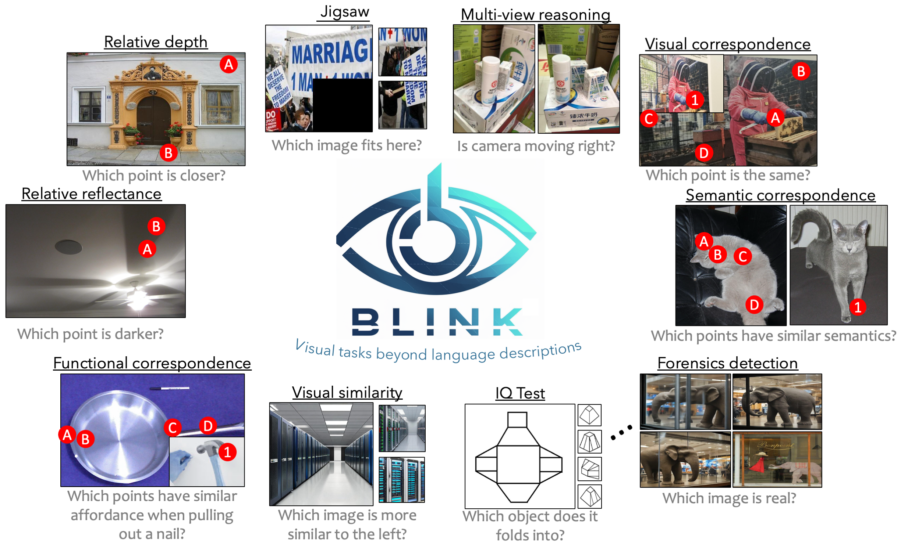

# BLINK
This repo contains evaluation code for the paper "[BLINK: Multimodal Large Language Models Can See but Not Perceive](https://arxiv.org/abs/2404.12390.pdf)" [ECCV 2024]

[**🌐 Homepage**](https://zeyofu.github.io/blink/) | [**🤗 Dataset**](https://huggingface.co/datasets/BLINK-Benchmark/BLINK) | [**📑 Paper**](https://arxiv.org/abs/2404.12390.pdf) | [**💻 Code**](https://arxiv.org/abs/2404.12390.pdf) | [**📖 arXiv**](https://arxiv.org/abs/2404.12390) | [**🔗 EvalAI**](https://eval.ai/web/challenges/challenge-page/2287/overview)


## 🔔News

 **🔥[2024-07-03]: We added a validation set leaderboard on the website.**
 
 **🔥[2024-07-01]: BLINK is accepted to ECCV 2024!**
 
 **🔥[2024-06-16]: We added the scores and outputs for GPT-4o and GPT-4 Turbo.**
 
 **🔥[2024-05-18]: [Gemini 1.5 Pro](https://twitter.com/ashkamath20/status/1791949907500081534) achieved great improvements on BLINK!**
 
 **🔥[2024-04-24]: Evaluation for test set is now availble on [EvalAI](https://eval.ai/web/challenges/challenge-page/2287/overview). We welcome all submissions and look forward to your participation!**

## Introduction
We introduce **BLINK**, a new benchmark for multimodal language models (LLMs) that focuses on core visual perception abilities not found in other evaluations. Most of the **BLINK** tasks can be solved by humans “within a blink” (e.g., *relative depth estimation, visual correspondence, forensics detection, and multi-view reasoning*). However, we find these perception-demanding tasks cast significant challenges for current multimodal LLMs because they resist mediation through natural language. **BLINK** reformats 14 classic computer vision tasks into 3,807 multiple-choice questions, paired with single or multiple images and visual prompting. While humans get 95.70% accuracy on average, **BLINK** is surprisingly challenging for existing multimodal LLMs: even the best-performing GPT-4V and Gemini achieve accuracies of 51.26% and 45.72%, only 13.17% and 7.63% higher than random guessing, indicating that such perception abilities have not “emerged” yet in recent multimodal LLMs. Our analysis also highlights that specialist CV models could solve these problems much better, suggesting potential pathways for future improvements. We believe **BLINK** will stimulate the community to help multimodal LLMs catch up with human-level visual perception.


## Dataset Creation

BLINK is created to challenge multimodal models on hollistic visual perception abilities with tasks inherited from classic computer vision problems, stimulating future development of multimodal LLMs that achieve human-level visual perception. Please refer to our huggingface [**🤗 Dataset**](https://huggingface.co/datasets/BLINK-Benchmark/BLINK) for more details.
**Unique Features** of BLINK includes diverse visual prompting, beyond recognition perception, and visual commonsense.

<!--  -->
## Load Dataset
```
import datasets

dataset_name = 'BLINK-Benchmark/BLINK'
data = load_dataset(dataset_name, SUBTASK_NAME)
```
where `SUBTASK_NAME` is one of the subtasks: `['Art_Style', 'Functional_Correspondence', 'Multi-view_Reasoning', 'Relative_Reflectance', 'Visual_Correspondence', 'Counting', 'IQ_Test', 'Object_Localization', 'Semantic_Correspondence', 'Visual_Similarity', 'Forensic_Detection', 'Jigsaw', 'Relative_Depth', 'Spatial_Relation']`

## Evaluation
Please refer to our [eval](eval)
 folder for more details.
 


## 🏆 Mini-Leaderboard
| Model                      | Val (1,901) | Test (1,907) |
|----------------------------|:-----------:|:------------:|
|🏅 Human                    |     95.7    |     95.7     |
|🥈 GPT-4o                   |     60.0    |   **59.0**   |
|🥉 GPT-4 Turbo              |     54.6    |     53.9     |
| GPT-4 (vision preview)   |     51.1    |     51.3     |
| Gemini Pro 1.0              |     45.2    |     45.7     |
| LLaVA-1.6-34B              |     46.8    |     45.1     |
| Claude 3 Opus              |     44.1    |     44.1     |
| Yi-VL-34B                  |     41.7    |     42.8     |
| Qwen-VL-MAX                |     40.3    |     42.0     |
| LLaVA-v1.5-13B-xtuner      |     42.0    |     41.3     |
| Yi-VL-6B                   |     38.7    |     41.7     |
| LLaVA-v1.5-7B-xtuner       |     39.4    |     40.8     |
| LLaVA-1.5-13B              |     42.7    |     40.6     |
| InstructBLIP-13B           |     42.2    |     39.6     |
| CogVLM                     |     41.5    |     39.4     |
| InstructBLIP-7B            |     39.7    |     38.7     |
| OpenFlamingo2-9B           |     39.2    |     38.3     |
|👀 **Random Choice**        |     38.1    |     38.1     |
| LLaVA-1.5-7B               |     37.1    |     38.0     |
| LLaVA-internLM2-7B         |     37.7    |     36.1     |
| MiniGPT-4-v2-7B            |     34.2    |     34.6     |

🎯 **We have released a full suite comprising 1,901 [validation samples](https://huggingface.co/datasets/BLINK-Benchmark/BLINK), the [prompt](https://huggingface.co/datasets/BLINK-Benchmark/BLINK) we used, and [model predictions](eval/saved_outputs) for the baselines tested in our paper. However, the 1,907 test questions are available without their answers.** You can submit your model's predictions for the **test set** on **[EvalAI](https://eval.ai/web/challenges/challenge-page/2287/overview)**.

## Disclaimers
Blink makes use of data from existing image datasets, and does not cover all the visual perception abilities in the wild. For the forensics detection task, we manually collected images that are publicly available from online search. We have made every effort to ensure that the images included in this paper are used in accordance with applicable copyright laws and are properly credited. However, if you are the copyright owner of any image included in our work and believe that its use conflicts with your licensing agreements, please [contact](#contact) us directly. We are committed to addressing any legitimate concerns promptly.

## Contact
- Xingyu Fu: xingyuf2@seas.upenn.edu
- Yushi Hu:  yushihu@uw.edu
- Wei-Chiu Ma:    weichiu@cornell.edu
- Ranjay Krishna: ​ranjay@cs.washington.edu

## Citation

**BibTeX:**
```bibtex
@article{fu2024blink,
  title={BLINK: Multimodal Large Language Models Can See but Not Perceive},
  author={Fu, Xingyu and Hu, Yushi and Li, Bangzheng and Feng, Yu and Wang, Haoyu and Lin, Xudong and Roth, Dan and Smith, Noah A and Ma, Wei-Chiu and Krishna, Ranjay},
  journal={arXiv preprint arXiv:2404.12390},
  year={2024}
}
```
